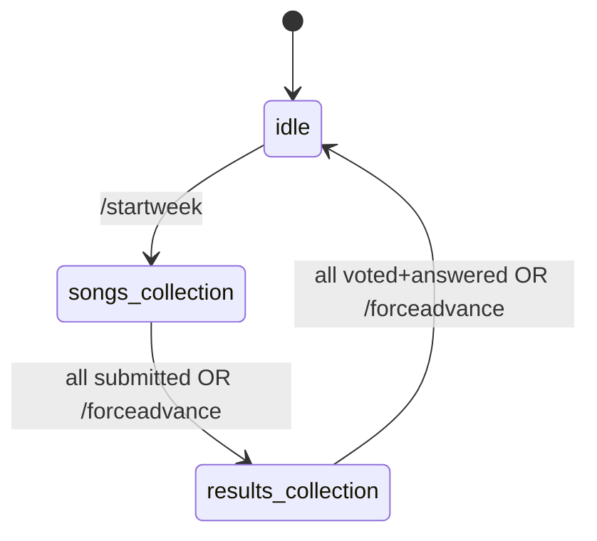

# Bot Scaffolding, Submission, and Voting Cycle

## Summary

Build the Music Contest Telegram bot's full weekly cycle end to end: Go scaffolding, the SQLite data model, a long-polling core, and the `idle → songs_collection → results_collection → idle` state machine. This covers participant tracking, song submission, voting and the familiarity questionnaire, anonymous publication, and deployment to a Raspberry Pi Zero W as a systemd service. Weeks belong to contests, each contest holding its own topic pool.

## Problem Frame

The repository is currently empty. The project's contest rules and technical design are already fully specified in Notion, and development was split into four tasks, with this brainstorm starting from Task 1 ("scaffolding, submission, and publication"). During dialogue, the scope grew in two ways: voting and the familiarity questionnaire (originally Task 2) were pulled forward because shipping submission alone, with no way to close out a week, isn't independently useful; and a new `contests` grouping was added so that weeks, and their topic pools, belong to a specific contest rather than running as one unbounded sequence.

## Key Decisions

- **Generic per-state deadlines.** Both `songs_collection` and `results_collection` use the same deadline mechanic — day 4 (counting the start day as day 1) at 12:00 Europe/Madrid by default, overridable per state via `/modifylimit` — replacing the original rules' fixed "Wednesday" / "Sunday" framing.
- **Minimal but real topic selection now.** `/startweek` performs random no-repeat-until-exhausted topic selection from the active contest's pool. Full pool-management commands (`/addtopic`, `/removetopic`, `/listtopics`) stay deferred to a later task.
- **Anonymous publication.** Songs publish in shuffled order with no sender attribution, so voting in `results_collection` isn't biased by who sent what. Attribution surfaces later, at results time.
- **Snapshot participants at week start.** The set of participants required to act for a week is fixed when `songs_collection` opens. Joining later doesn't add a requirement until the next week; leaving doesn't remove one — a participant who leaves mid-week still accrues a strike if they don't complete their part.
- **Strikes without consequence, for now.** A strike accrues on any missed deadline (submission, or the combined vote+questionnaire). Strikes accumulate indefinitely but trigger no automatic exclusion at this stage.
- **Contests as a new top-level grouping.** `/startcontest` creates and activates a contest; only one is active at a time, and starting a new one deactivates the previous. Each contest has its own independent topic-usage pool.
- **Dual detection for participants.** Telegram `chat_member` events update the roster automatically; `/syncparticipants` exists as an admin-triggered reconciliation pass for bootstrap and for recovering from any missed events.

## Actors

- **Admin** — a Telegram group admin; runs all `/start*`, `/modifylimit`, `/forceadvance`, `/fixsubmission`, `/removesubmission`, `/syncparticipants` commands.
- **Participant** — an active, contest-eligible group member; submits songs, ranks others' songs, and answers the familiarity questionnaire privately.
- **Bot** — orchestrates the tick-driven state machine, sends reminders, and publishes songs and results in the group.

## Week Lifecycle

## Requirements

**Contest & week lifecycle**

- R1. `/startcontest <name>` creates a new contest and makes it active; starting a new contest deactivates the previously active one.
- R2. `/startweek` (admin-only) selects a random unused topic from the active contest's pool, announces it in the group, and transitions the week from `idle` to `songs_collection`.
- R3. The week state machine is `idle → songs_collection → results_collection → idle`, with one active week per contest at a time.
- R4. Each of `songs_collection` and `results_collection` has a default deadline of day 4 (the start day counts as day 1) at 12:00 Europe/Madrid.
- R5. `/modifylimit` (admin-only) changes the deadline of whichever state is currently active; the change doesn't carry over to the next state.
- R6. `/forceadvance` (admin-only) closes the active state immediately — publishing songs from `songs_collection` or results from `results_collection` — regardless of how many participants have completed the required action.
- R7. Topic usage is tracked per contest; starting a new contest resets all topics to unused within that contest.

**Participants**

- R8. The bot listens to Telegram `chat_member` events to add or remove participants from the roster automatically.
- R9. `/syncparticipants` (admin-only) fetches the current Telegram group member list and reconciles it against the roster — adding missing members, marking departed ones inactive — usable at bootstrap and at any later point.
- R10. The set of participants required to act for a week is snapshotted from active participants when `songs_collection` opens.
- R11. A participant who leaves the group during an active week remains on the hook for that week's requirement and accrues a strike if they don't complete it.

**Submissions**

- R12. Participants submit a song by sending a YouTube URL to the bot in a private message during `songs_collection`.
- R13. The bot validates only the URL's format (no YouTube API call) and confirms or rejects the submission.
- R14. While `songs_collection` is open, the bot sends a daily reminder in the group (20:00 Europe/Madrid) listing required participants who haven't submitted yet.
- R15. `/fixsubmission @user <url>` (admin-only) replaces a participant's submission for the active week.
- R16. `/removesubmission @user` (admin-only) deletes a participant's submission for the active week.

**Publication**

- R17. Once every required participant has submitted, the bot publishes all songs in the group at once, in shuffled order, without attributing any song to its sender.
- R18. If `/forceadvance` closes `songs_collection` early, the bot publishes whichever songs exist at that moment under the same anonymous/shuffled rule.

**Voting & questionnaire**

- R19. On entering `results_collection`, the bot privately sends each required participant the familiarity questionnaire (one "already knew it" toggle per published song, plus a confirm button) and the song-ranking flow.
- R20. The ranking flow presents a participant's remaining unranked songs (excluding their own) as buttons; picking one removes it from the list, repeating until all are strictly ordered with no ties.
- R21. Points are assigned by descending rank — 5 for the top song, decrementing by 1 down to the lowest-ranked song.
- R22. A participant counts as "done" only once they've completed both the questionnaire and the ranking; missing either by the deadline (or at `/forceadvance`) is one strike, not two.
- R23. Once every required participant is done, or `/forceadvance` closes `results_collection` early, the bot publishes per-song/per-participant points and the familiarity outcome, then the week returns to `idle`.
- R24. A song marked "already knew it" by 3 or more participants is disqualified: its voting points are zeroed with no redistribution to other songs, and the submitter receives no penalty beyond the lost points.

**Strikes**

- R25. A strike is recorded against a participant for each week they don't complete their required action by the time that state closes, whether closed naturally or via `/forceadvance`.
- R26. Strikes accumulate per participant indefinitely with no automatic consequence at this stage.

**Deployment & operations**

- R27. The bot is a single Go binary using `go-telegram/bot` (long-polling) and `modernc.org/sqlite`, persisting all conversation and week state so a process restart resumes exactly where it left off.
- R28. A periodic tick (~15 minutes) re-evaluates the active week's state against the database and current time (Europe/Madrid), driving reminders, deadline checks, and transitions.
- R29. The binary cross-compiles for `GOOS=linux GOARCH=arm GOARM=6` and runs on the Raspberry Pi Zero W as a systemd service with auto-restart on failure and start-on-boot.
- R30. `/help` lists whichever commands exist at this stage; weekly-score calculation and `/standings` are not part of this build.

## Key Flows

- F1. **Songs collection cycle**
  - **Trigger:** Admin runs `/startweek` with an active contest and no other week in progress.
  - **Actors:** Admin, Bot, Participant
  - **Steps:** Bot picks an unused topic from the active contest's pool → announces it in the group → snapshots required participants → opens `songs_collection` with the default deadline → sends daily reminders for stragglers → on all-required-submitted or `/forceadvance`, closes the state, publishes songs anonymously/shuffled, and opens `results_collection`.
  - **Outcome:** Published songs carry no attribution; any straggler accrues a strike.
  - **Covers:** R2, R4, R10, R12–R18, R25

- F2. **Results collection cycle**
  - **Trigger:** `songs_collection` closes, naturally or forced.
  - **Actors:** Admin, Bot, Participant
  - **Steps:** Bot privately sends each required participant the questionnaire and the strict-ranking flow → participant completes both → on all-required-done or `/forceadvance`, bot computes points and applies disqualification for songs known by 3+ participants → publishes results and the familiarity outcome → week returns to `idle`.
  - **Outcome:** Disqualified songs lose voting points without redistribution; a straggler accrues exactly one strike regardless of which half they missed.
  - **Covers:** R19–R26

## Acceptance Examples

- AE1. **Default deadline.** Given `/startweek` runs on a Monday with no `/modifylimit` issued, when the bot checks the deadline, then it is Thursday 12:00 Europe/Madrid (day 4, Monday = day 1). **Covers R4.**
- AE2. **Waiting on a straggler.** Given `songs_collection`'s deadline has passed and one required participant hasn't submitted, when no `/forceadvance` is issued, then the bot keeps waiting and does not publish, while that participant accrues a strike. **Covers R14, R17, R25.**
- AE3. **Forced close mid-week.** Given the admin runs `/forceadvance` during `songs_collection` with 2 of 5 participants still missing, when the command runs, then the bot publishes the 3 received songs anonymously/shuffled immediately, and the 2 missing participants each accrue a strike. **Covers R6, R18, R25.**
- AE4. **Partial completion in results_collection.** Given a participant has finished the questionnaire but not the ranking by the deadline, when the deadline passes or `/forceadvance` fires, then that participant accrues exactly one strike, not two. **Covers R22, R25.**
- AE5. **Disqualification.** Given a song is marked "already knew it" by 3 of 5 voting participants, when weekly results publish, then that song's voting points are zeroed and not redistributed, while every other song keeps the points it was assigned in voting. **Covers R24.**
- AE6. **Per-contest topic reset.** Given topic "80s rock" was used in Contest A, when the admin runs `/startcontest "Season 2"`, then "80s rock" is eligible for selection again under the new contest's pool. **Covers R1, R7.**

## Scope Boundaries

**Deferred for later**

- Weekly-score calculation and season-standings publication (`/standings`).
- Full topic-pool admin commands (`/addtopic`, `/removetopic`, `/listtopics`).
- Strike-based expulsion or any other automatic consequence of accumulated strikes.
- An explicit contest-closing command — starting a new contest implicitly ends the previous one; there's no standalone "end contest" action.

## Dependencies / Assumptions

- The bot must be a Telegram group admin to reliably receive `chat_member` events for automatic participant detection.
- Only one contest and one week can be active at any time.
- Exact wording for bot messages (reminders, announcements, questionnaire prompts) is left to planning.

## Sources / Research

- [Reglas del concurso](https://app.notion.com/p/38303d3fc17a81e5bb5af1218aafd4b4) — contest rules: voting, scoring, disqualification, season standings.
- [Diseño técnico](https://app.notion.com/p/38403d3fc17a8189b68af845f51d2d43) — tech stack, original data model, command inventory, tick-based orchestration design.
- [Tareas de desarrollo](https://app.notion.com/p/38403d3fc17a811a8520d9bfeb8c3761) — the 4-task development breakdown this brainstorm started from and partially merged (Task 1 + Task 2).
