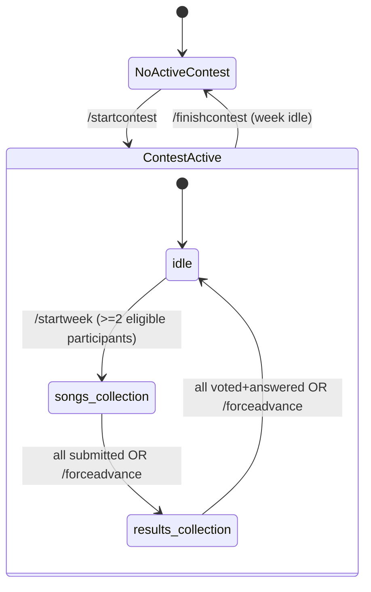
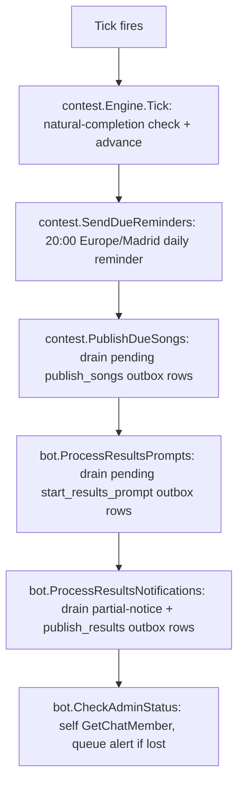
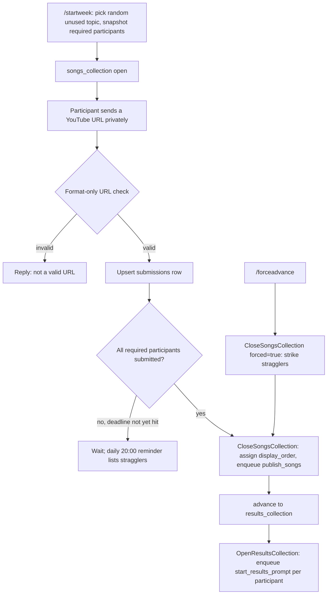
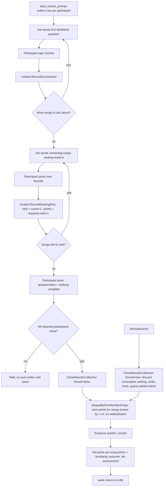

# Flows

## Contest / week state machine

`/startcontest` resets every participant's strike count and the new
contest's topic pool (KTD7, R10, R12) -- the pool reset falls out of the
schema for free, since `topic_usage` rows are scoped per `contest_id`.

## Tick (every 15 minutes, plus once on startup)

Each step is independent and logs its own failure rather than aborting the
rest (a stalled Telegram call in one step shouldn't block the others). The
lock inside `contest.Engine` (KTD5) covers both admin commands and this
tick's own auto-advance check, so a tick-driven close can't race a
concurrent `/forceadvance`.

## Songs collection cycle (songs_collection)

## Results collection cycle (results_collection)

