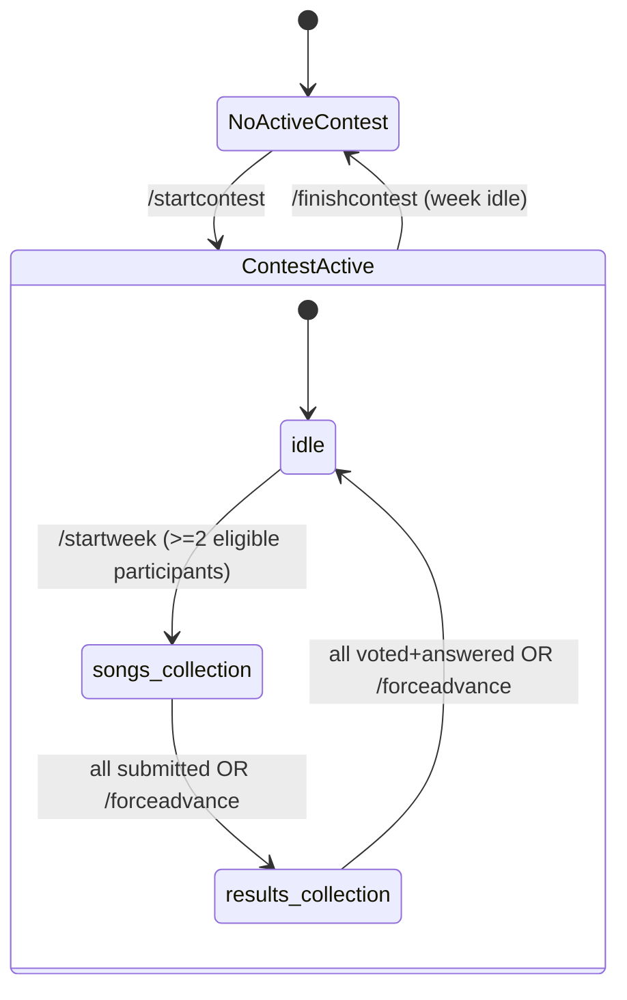
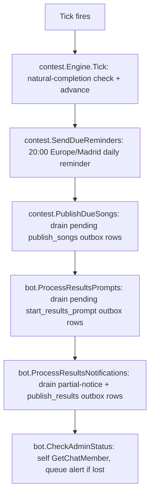
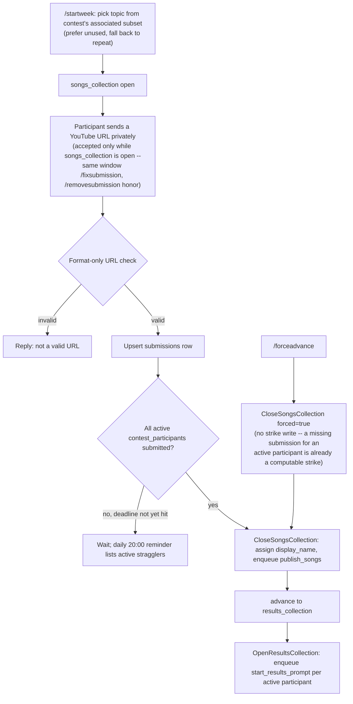
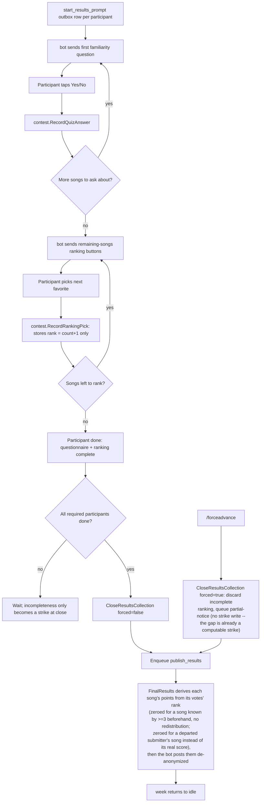

# Flows

## Contest / week state machine

`/startcontest` enrolls every currently-active Telegram participant into
`contest_participants` (no later joiners) and associates the seeded
`"normal"` topic so the new contest's catalog is never empty (R1, R16).
Strikes are never reset -- they're computed per contest from
`contest_participants`/`weeks`/`submissions`/`votes`/`quiz_answers`, so a new
contest naturally starts at zero without any explicit reset step. When a
participant leaves the Telegram group, `participants.active` flips false and
`contest_participants.left_at` is set for whichever contest is active (R3):
they stop blocking week completion and their contribution is zeroed/marked
in results, without erasing what they already did.

## Tick (every 15 minutes, plus once on startup)

Each step is independent and logs its own failure rather than aborting the
rest (a stalled Telegram call in one step shouldn't block the others). The
lock inside `contest.Engine` (KTD5) covers both admin commands and this
tick's own auto-advance check, so a tick-driven close can't race a
concurrent `/forceadvance`.

## Songs collection cycle (songs_collection)

## Results collection cycle (results_collection)

