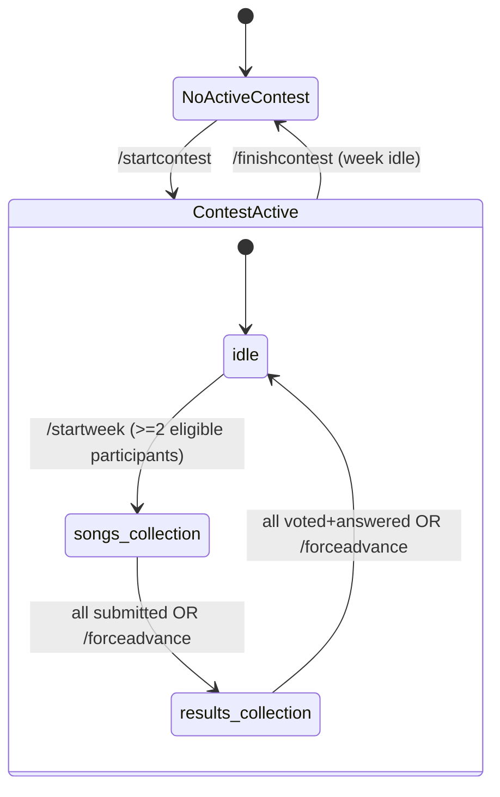
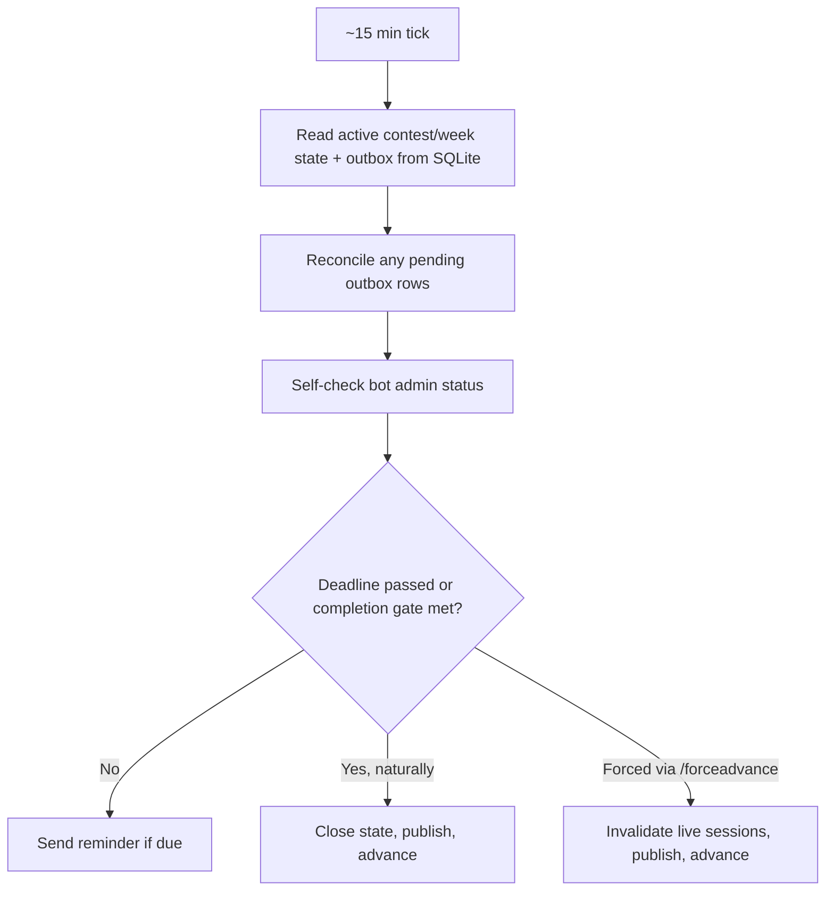

# Music Contest Telegram Bot — Core Cycle, Submission, and Voting

## Summary

Build the Music Contest Telegram bot from scratch in Go: project scaffolding, the SQLite data model, a long-polling bot core, and the full `idle → songs_collection → results_collection → idle` week cycle grouped under contests — covering participant tracking, song submission, anonymous publication, voting, the familiarity questionnaire, a per-contest strike system, and deployment to a Raspberry Pi Zero W as a systemd service.

## Problem Frame

The repository is empty today — no `go.mod`, no code, no CI. The contest's rules and technical shape are fully decided in the origin requirements doc, which merged the original Task 1 ("scaffolding, submission, publication") and Task 2 ("voting and questionnaire") into one buildable arc, added a `contests` grouping, and resolved a per-state deadline mechanic with admin overrides. Planning research found no local Go patterns to follow (greenfield) and surfaced gaps the origin doc didn't speak to: durable handling of side-effecting actions across process restarts, command-race protection, an explicit way to close a contest, and per-contest strike scope.

---

## Key Technical Decisions

- KTD1. **Single Go binary, `internal/` package layout.** `cmd/musiccontestbot/main.go` as a thin entrypoint; all logic under `internal/` (`bot`, `contest`, `storage`, `config`) since nothing here is consumed as an importable library.
- KTD2. **`modernc.org/sqlite` with WAL, tuned for the Pi Zero W's 512MB/single-core ceiling.** Pure-Go driver (registers as `"sqlite"`, not `"sqlite3"`) avoids any CGO/cross-toolchain need for `GOARM=6`. DSN sets `_pragma=journal_mode(WAL)&_pragma=busy_timeout(5000)&_pragma=synchronous(NORMAL)&_pragma=foreign_keys(ON)&_pragma=cache_size(-2000)` (cache capped around 2MB, not desktop-class defaults); `db.SetMaxOpenConns(1)` avoids `SQLITE_BUSY` races known to this driver under concurrent connections; `GOMAXPROCS` left at its single-core default. WAL needs periodic checkpointing — the graceful-shutdown path (R31, U7) explicitly checkpoints on exit so the `-wal` file doesn't grow unbounded on limited flash between deploys.
- KTD3. **`pressly/goose` for embedded migrations.** `golang-migrate`'s sqlite source is hard-wired to the `mattn/go-sqlite3` driver name and breaks under `modernc.org/sqlite`; goose works against any `database/sql` driver and supports `//go:embed`'d `.sql` files baked into the single binary.
- KTD4. **Durable outbox for side-effecting actions.** Every reminder, publication, and result announcement is written as a `pending` row in the same transaction that decides to send it, then marked `done` after the Telegram call succeeds. On startup and on each tick, the bot reconciles any row left `pending`/`in_progress` instead of trusting in-memory state, so a crash mid-action can't duplicate or silently drop it.
- KTD5. **Serialized state-mutating commands.** `/startweek`, `/forceadvance`, `/modifylimit`, `/startcontest`, `/finishcontest` all acquire a single in-process lock and re-read state inside it before acting, so two admins racing a command can't double-transition the state machine.
- KTD6. **Zoned-time deadline calculation, recomputed per tick.** Deadlines are stored and compared as `time.Time` in `Europe/Madrid`, never pre-converted to a cached UTC instant, so DST transitions don't silently shift a deadline by an hour.
- KTD7. **Strikes scoped per contest.** A participant's strike count resets when a new contest starts, mirroring the per-contest topic pool — this revises the origin doc's "strikes accumulate indefinitely" framing, resolved during planning dialogue.
- KTD8. **Roster identity keyed by Telegram user ID.** `/syncparticipants` and the `chat_member` handler both upsert by Telegram user ID, never insert a second roster row for a participant who left and rejoined, so strike history and contest membership stay attached to one identity.

---

## Requirements

**Project scaffolding & data model**

- R1. The project builds as a single Go binary from `cmd/musiccontestbot`, with business logic under `internal/`. (origin R27)
- R2. The SQLite schema is created and evolved via embedded, version-controlled migrations applied automatically on startup. (origin R27; KTD3)
- R3. The schema includes `contests`, `weeks`, `topics` (per-contest usage), `participants` (with per-contest strike count), `submissions`, `votes`, `quiz_answers`, and a durable action-outbox table. (origin data model intent, expanded per KTD4/KTD7)

**Contest & week lifecycle**

- R4. `/startcontest <name>` creates and activates a contest, deactivating any previously active one. (origin R1)
- R5. `/finishcontest` deactivates the active contest, but only succeeds while the active week is `idle`; while no contest is active, `/startweek` rejects with a clear message. (new, this plan)
- R6. `/startweek` selects a random unused topic from the active contest's pool, requires at least 2 active eligible participants, announces the topic, and opens `songs_collection`. (origin R2; participant-count guard new, this plan)
- R7. The week state machine is `idle → songs_collection → results_collection → idle`, one active week per contest. (origin R3)
- R8. Each of `songs_collection` and `results_collection` defaults to a day-4 (start day = day 1), 12:00 Europe/Madrid deadline, overridable for the current state only via `/modifylimit`. (origin R4, R5; KTD6)
- R9. `/forceadvance` closes the active state immediately regardless of completion, publishing songs or results as appropriate. (origin R6)
- R10. Topic usage resets to unused when a new contest starts. (origin R7)
- R11. A week's required-participant set is snapshotted from active, eligible participants when `songs_collection` opens; a participant who leaves mid-week stays on the hook and strikes if they don't complete their part. (origin R10, R11)
- R12. `/startcontest` resets every participant's strike count to zero as part of activating the new contest. (origin R26, revised per KTD7)

**Participants**

- R13. The bot updates the roster automatically from Telegram `chat_member` events. (origin R8)
- R14. `/syncparticipants` reconciles the roster against Telegram's live group member list, usable at bootstrap and any time after. (origin R9; KTD8)
- R15. The bot checks its own admin status each tick and posts a group alert if it has lost admin rights. (new, this plan — `chat_member` detection otherwise degrades silently)

**Submissions**

- R16. Participants submit a song via a private YouTube URL message during `songs_collection`; the bot validates URL format only. (origin R12, R13)
- R17. While `songs_collection` is open, the bot posts a daily reminder (20:00 Europe/Madrid) naming participants who haven't submitted. (origin R14)
- R18. `/fixsubmission @user <url>` and `/removesubmission @user` let an admin replace or delete a submission for the active week. (origin R15, R16)
- R19. Once every required participant has submitted, or `/forceadvance` closes the state, the bot publishes all songs at once in shuffled order with no sender attribution. (origin R17, R18)
- R20. A strike is recorded for any required participant who hasn't submitted by the time `songs_collection` closes, naturally or forced. (origin R25)

**Voting & questionnaire**

- R21. On entering `results_collection`, the bot privately sends each required participant the familiarity questionnaire and the strict song-ranking flow. (origin R19)
- R22. The ranking flow presents remaining unranked songs (excluding the participant's own) as buttons; picking one removes it and repeats until a strict order with no ties is produced. (origin R20)
- R23. Points are assigned by descending rank, 5 down to 1. (origin R21)
- R24. A participant counts as "done" only once both the questionnaire and the ranking are complete; missing either by the deadline or at `/forceadvance` is one strike, not two, and a forced close discards any incomplete ranking entirely rather than scoring it partially. (origin R22; partial-ranking-discard new, this plan)
- R25. `/forceadvance` notifies any participant whose in-flight ranking or questionnaire session gets invalidated that their partial progress wasn't counted. (new, this plan)
- R26. Once every required participant is done, or `/forceadvance` closes the state, the bot publishes per-song/per-participant points and the familiarity outcome, then the week returns to `idle`. (origin R23)
- R27. A song marked "already knew it" by 3 or more participants is disqualified: its voting points are zeroed with no redistribution, and the submitter receives no further penalty. (origin R24)
- R28. A strike is recorded for any required participant who isn't "done" by the time `results_collection` closes, naturally or forced. (origin R25)

**Deployment & operations**

- R29. The bot persists all conversation and week state to SQLite so a process restart resumes exactly where it left off, with no duplicated or dropped actions. (origin R27, R28; KTD4)
- R30. A periodic ~15-minute tick re-evaluates the active week's state against the database and current time, driving reminders, deadline checks, and transitions. (origin R28)
- R31. The binary cross-compiles for `GOOS=linux GOARCH=arm GOARM=6 CGO_ENABLED=0` and runs on the Raspberry Pi Zero W as a systemd service with auto-restart on failure and start-on-boot, shutting down gracefully on `SIGTERM`. (origin R29)
- R32. `docs/uml.md` and `docs/flows.md` are created covering this architecture, its state machine, and its flows, per the repository's documentation convention. (new, this plan)

---

## High-Level Technical Design





---

## Output Structure

```text
cmd/
  musiccontestbot/
    main.go
internal/
  config/
  bot/
    handlers.go
    middleware.go
    chatmember.go
    adminstatus.go
    submission.go
    voting.go
    questionnaire.go
  contest/
    lifecycle.go
    deadline.go
    tick.go
    reminder.go
    publish.go
    results.go
  storage/
    db.go
    migrations/
      0001_init.sql
docs/
  uml.md
  flows.md
deploy/
  musiccontestbot.service
Makefile
go.mod
```

---

## Implementation Units

### U1. Go module scaffolding and project layout

- **Goal:** Establish the Go module, directory layout, config loading, and build tooling so later units have somewhere to land.
- **Requirements:** R1, R31
- **Dependencies:** none
- **Files:** `go.mod`, `cmd/musiccontestbot/main.go`, `internal/config/config.go`, `internal/config/config_test.go`, `Makefile`
- **Approach:** `internal/config` reads the bot token, group chat ID, and DB path from environment variables, failing fast with a clear error if any are missing. `Makefile` exposes `build` (host) and `build-pi` (`GOOS=linux GOARCH=arm GOARM=6 CGO_ENABLED=0`) targets.
- **Patterns to follow:** none locally (greenfield); standard Go single-binary layout (`cmd/`, `internal/`).
- **Test scenarios:**
  - Happy path: all required env vars set → config loads with expected values.
  - Error path: missing bot token / missing chat ID / missing DB path → each returns a distinct, named error.
- **Verification:** `go build ./...` succeeds on host; `make build-pi` succeeds with the ARM target env vars.

### U2. SQLite schema and durable storage layer

- **Goal:** Define the full data model and a storage layer that supports the durable-outbox pattern.
- **Requirements:** R2, R3, R29; KTD2, KTD3, KTD4
- **Dependencies:** U1
- **Files:** `internal/storage/db.go`, `internal/storage/migrations/0001_init.sql`, `internal/storage/db_test.go`
- **Approach:** Open `modernc.org/sqlite` with the WAL/busy_timeout/synchronous/foreign_keys DSN pragmas from KTD2, `SetMaxOpenConns(1)`. Apply goose migrations from an embedded `migrations` filesystem on startup. Schema covers `contests` (id, name, active flag), `weeks` (contest_id, state, topic_id, opened_at, deadline), `topics` (contest_id, text, used flag), `participants` (telegram_user_id unique, active flag, strikes scoped to current contest per KTD7), `submissions`, `votes`, `quiz_answers`, and an `outbox_actions` table (action type, payload, status, timestamps) per KTD4.
- **Technical design:** `outbox_actions(id, action_type, payload_json, status[pending|done], created_at, completed_at)` — directional only, exact columns settle during implementation.
- **Patterns to follow:** KTD2/KTD3 research findings on driver DSN and goose usage.
- **Test scenarios:**
  - Happy path: fresh DB → all migrations apply, expected tables exist.
  - Edge case: re-running migrations on an already-migrated DB is a no-op.
  - Integration: writing and reading an `outbox_actions` row through the real driver round-trips status correctly.
- **Verification:** A test DB file can be created, migrated, and queried for every table without error.

### U3. Telegram bot core, command routing, and participant detection

- **Goal:** Stand up the long-polling bot, route group/private messages and admin-only commands, and keep the roster in sync.
- **Requirements:** R13, R14, R15; KTD8
- **Dependencies:** U1, U2
- **Files:** `internal/bot/bot.go`, `internal/bot/middleware.go`, `internal/bot/chatmember.go`, `internal/bot/chatmember_test.go`, `internal/bot/adminstatus.go`
- **Approach:** `bot.New` with `WithAllowedUpdates` including `chat_member`; an admin-check middleware calls `GetChatMember` on the sender before allowing admin-only commands. The `chat_member` handler and `/syncparticipants` both upsert `participants` by `telegram_user_id` (KTD8). A self-admin-status check (called from the tick wired in U4) posts a group alert via the outbox if the bot is no longer admin.
- **Patterns to follow:** `go-telegram/bot` long-polling + `RegisterHandler`/default-handler pattern; admin check via `GetChatMember` status inspection.
- **Test scenarios:**
  - Happy path: a `chat_member` update with status "member" upserts a new participant row.
  - Happy path: `/syncparticipants` adds a participant present in Telegram's member list but missing locally, and marks inactive one that's missing from Telegram's list but present locally.
  - Edge case: a participant who left and rejoined produces one roster row, not two, and their prior strike count is preserved.
  - Edge case: an admin-only command from a non-admin sender is rejected with a clear message.
  - Integration: bot losing admin status produces an outbox-queued group alert on the next tick.
- **Verification:** Roster reflects a simulated sequence of join/leave/rejoin events with exactly one row per Telegram user ID and correct active flags.

### U4. Contest and week lifecycle engine

- **Goal:** Implement `/startcontest`, `/finishcontest`, `/startweek`, `/modifylimit`, `/forceadvance`, the per-contest strike/topic reset, and the tick-driven state machine with serialized command handling.
- **Requirements:** R4–R12; KTD5, KTD6, KTD7
- **Dependencies:** U2, U3
- **Files:** `internal/contest/lifecycle.go`, `internal/contest/deadline.go`, `internal/contest/tick.go`, `internal/contest/lifecycle_test.go`, `internal/contest/deadline_test.go`
- **Approach:** A single in-process lock guards every state-mutating command (KTD5); each handler re-reads current state inside the lock before acting and rejects with a clear message if a precondition no longer holds (e.g., `/startweek` with no active contest, or fewer than 2 eligible participants; `/finishcontest` with a non-idle week). `/startcontest` resets every participant's strike count to 0 and the contest's topic pool to unused in the same transaction that activates it (KTD7, R10, R12). Deadlines computed and compared as `Europe/Madrid`-zoned `time.Time` per KTD6, recalculated on each tick rather than cached.
- **Technical design:** `deadline(state_started_at, override_days?) = date(state_started_at) + (override_days ?? 4 - 1) days, at 12:00 Europe/Madrid` — directional only.
- **Patterns to follow:** none locally; this is the plan's own design.
- **Test scenarios:**
  - Happy path: `/startweek` on a Monday with no override yields a Thursday 12:00 Europe/Madrid deadline. Covers AE1.
  - Happy path: `/startcontest` deactivates a previously active contest and resets that contest's topic pool and all participants' strikes. Covers AE6.
  - Edge case: `/startweek` with 1 eligible participant is rejected.
  - Edge case: `/finishcontest` while a week is `songs_collection` is rejected with a clear message; succeeds once the week returns to `idle`.
  - Edge case: deadline calculation across a DST transition date stays at the correct wall-clock hour.
  - Error path: `/startweek` with no active contest is rejected.
  - Integration: two simulated concurrent `/forceadvance` calls result in exactly one state transition, not two.
- **Verification:** A scripted sequence of commands against a test DB produces the expected state-machine trace with no duplicate transitions.

### U5. Song submission and publication flow

- **Goal:** Handle private song submissions, admin submission fixes, daily reminders, anonymous publication, and submission strikes.
- **Requirements:** R16–R20
- **Dependencies:** U3, U4
- **Files:** `internal/bot/submission.go`, `internal/bot/submission_test.go`, `internal/contest/reminder.go`, `internal/contest/publish.go`
- **Approach:** Private-message handler validates YouTube URL format only (no API call) and confirms/rejects. `/fixsubmission`/`/removesubmission` are admin-only, scoped to the active week. The tick checks for unsent daily reminders and for "all required submitted," queuing a shuffle-and-publish outbox action with no attribution when the gate is met, or when `/forceadvance` fires it strikes the remaining stragglers and publishes what exists.
- **Patterns to follow:** outbox pattern from U2/KTD4 for the reminder and publish actions.
- **Test scenarios:**
  - Happy path: a valid YouTube URL submitted privately during `songs_collection` is accepted and stored.
  - Error path: a malformed URL is rejected with a clear message and not stored.
  - Happy path: once the last required participant submits, songs publish in shuffled order with no sender names.
  - Edge case: `/forceadvance` during `songs_collection` with stragglers publishes only the received songs and strikes the missing participants. Covers AE3.
  - Edge case: a straggler past the deadline with no `/forceadvance` keeps waiting (no premature publish) and accrues a strike once the state eventually closes. Covers AE2.
  - Happy path: `/fixsubmission` replaces an existing submission; `/removesubmission` deletes one.
  - Integration: the daily reminder at 20:00 Europe/Madrid names exactly the still-missing required participants.
- **Verification:** A simulated week with a mix of on-time, late, and forced-close participants produces the expected publication contents and strike records.

### U6. Voting, questionnaire, and results flow

- **Goal:** Implement the strict-ranking and familiarity-questionnaire private flows, completion gating, disqualification, results publication, and vote/quiz strikes.
- **Requirements:** R21–R28
- **Dependencies:** U3, U4, U5
- **Files:** `internal/bot/voting.go`, `internal/bot/voting_test.go`, `internal/bot/questionnaire.go`, `internal/bot/questionnaire_test.go`, `internal/contest/results.go`, `internal/contest/results_test.go`
- **Approach:** Both flows persist step-by-step conversation state (current remaining songs to rank; current questionnaire answers) keyed by participant and week, so a process restart resumes mid-flow. A participant is "done" only once both flows report complete. `/forceadvance` invalidates any incomplete session for a participant, discarding partial progress and queuing a notification (R25), rather than scoring it. Results computation assigns points 5-down-to-1 by rank, zeroes points for any song known by 3+ participants with no redistribution, then queues the results-publication outbox action and records strikes for anyone not done.
- **Technical design:** `ranking_step(remaining_songs, choice) -> remove(choice, remaining_songs), append_to_order(choice)`; `questionnaire_step(song, known: bool) -> upsert(quiz_answers)`; `done(participant, week) = ranking_complete AND questionnaire_complete` — directional only.
- **Patterns to follow:** outbox pattern (U2) for results publication; inline-keyboard depletion pattern for the ranking flow; toggle-plus-confirm pattern for the questionnaire.
- **Test scenarios:**
  - Happy path: a participant ranks N-1 songs to completion via repeated button picks, producing a strict order with no ties.
  - Happy path: points assign 5 down to 1 by final rank.
  - Edge case: a song marked "already knew it" by exactly 3 of 5 participants is disqualified and zeroed with no redistribution to other songs. Covers AE5.
  - Edge case: a participant who completes the questionnaire but not the ranking by the deadline accrues exactly one strike. Covers AE4.
  - Edge case: `/forceadvance` mid-ranking invalidates that session, discards the partial order, and notifies the participant.
  - Error path: a participant cannot vote for their own submitted song (excluded from their ranking list).
  - Integration: a process restart mid-ranking resumes the participant at their last completed step, not from scratch.
- **Verification:** A simulated week with full and partial completions, plus a forced close, produces the expected per-participant points, disqualification outcomes, and strike records.

### U7. Deployment and architecture documentation

- **Goal:** Ship the systemd unit, the ARM build path, graceful shutdown, and the mandated architecture docs.
- **Requirements:** R30, R31, R32
- **Dependencies:** U1–U6
- **Files:** `deploy/musiccontestbot.service`, `docs/uml.md`, `docs/flows.md`
- **Approach:** The systemd unit uses `Type=simple`, a direct `ExecStart` (no shell wrapper, so `SIGTERM` reaches the Go process), `Restart=on-failure`, `RestartSec=5`, `After=network-online.target`, `WantedBy=multi-user.target`. The Go process installs a `signal.NotifyContext` handler for `SIGTERM`/`SIGINT` that cancels the shared context, stops the poller and ticker, and closes the DB (checkpointing WAL) before exit.
- **Patterns to follow:** systemd and graceful-shutdown guidance from best-practices research.
- **Test scenarios:**
  - Integration: sending `SIGTERM` to a running instance with an open DB connection completes any in-flight outbox write and exits cleanly within the shutdown timeout.
- **Verification:** `docs/uml.md` and `docs/flows.md` exist and reflect the state machine and the songs/results flows from the origin doc; `make build-pi` produces a binary; a local service-manager smoke test starts, stops, and auto-restarts per the unit file.

---

## Scope Boundaries

**Deferred for later**

- Weekly-score calculation and season-standings publication, and full topic-pool admin commands (`/addtopic`, `/removetopic`, `/listtopics`) — both explicitly out of scope per origin.
- Any automatic consequence of accumulated strikes (no expulsion logic yet) — origin R26, KTD7.

---

## Risks & Dependencies

- **Single SD card, no backup, no redundancy.** All state lives in one SQLite file on the Pi's SD card; card failure loses all contest history. This is an accepted risk carried from origin (see origin: Dependencies/Assumptions), not something this plan mitigates — flagged here so it's visible at plan level, not just in the brainstorm.
- **`modernc.org/sqlite`'s ARM/`GOARM=6` support is version-sensitive.** The driver is a transpiled-to-Go SQLite port; its `modernc.org/libc` dependency has occasionally lagged platform support for less-common GOOS/GOARCH/GOARM combinations. Mitigation: pin a recent `modernc.org/sqlite` tag and run a smoke build with the exact target env vars (U1's `make build-pi`) before relying on it on real hardware, rather than assuming any pinned version supports `arm/GOARM=6`.
- **Telegram long-polling reliability on a residential network.** The bot depends on outbound connectivity to Telegram's API from behind a home router; transient network loss stalls polling. Mitigation: rely on systemd's `Restart=on-failure` (U7) plus the outbox's startup reconciliation (KTD4) rather than building custom retry/backoff logic in-process — a documented pattern for this class of long-polling worker is to let the process crash and have the supervisor restart it cleanly after repeated `getUpdates` failures.
- **Single-writer SQLite discipline depends on disciplined connection use.** `db.SetMaxOpenConns(1)` (KTD2) is the chosen mitigation for this driver's known concurrent-connection footgun (see Sources / Research); any future unit that opens a second `*sql.DB` or bypasses the shared connection would silently reintroduce `SQLITE_BUSY` failures.

---

## Open Questions

**Deferred to Implementation**

- Exact outbox action-type enumeration and payload shape (R3, KTD4) — settles once the publish/reminder/alert call sites are written.
- Exact wording of bot-facing messages (reminders, rejection errors, the `/forceadvance` partial-progress notice) — left to implementation, per origin's Dependencies/Assumptions.

---

## Sources / Research

- Origin requirements: `docs/brainstorms/2026-06-19-bot-scaffolding-submission-voting-requirements.md`
- `go-telegram/bot` long-polling, handler registration, `chat_member` event wiring, and inline-keyboard patterns — github.com/go-telegram/bot, pkg.go.dev/github.com/go-telegram/bot
- `modernc.org/sqlite` driver name, DSN pragma syntax, and a concurrent-connection footgun specific to this driver — pkg.go.dev/modernc.org/sqlite, gitlab.com/cznic/sqlite/-/issues/115
- Migration tooling incompatibility between `golang-migrate` and `modernc.org/sqlite` — github.com/golang-migrate/migrate/issues/899
- Durable/outbox execution pattern for crash-safe Go background workers on SQLite — threedots.tech/post/sqlite-durable-execution
- systemd unit and graceful-shutdown conventions, and SQLite WAL/synchronous trade-offs on flash storage — sqlite.org/wal.html
