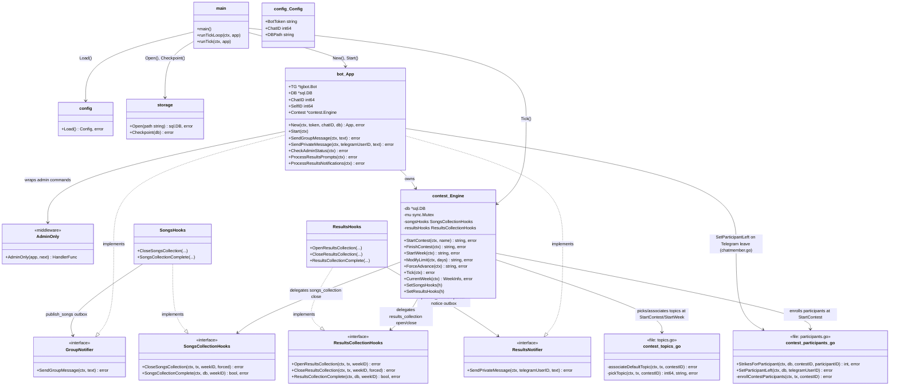
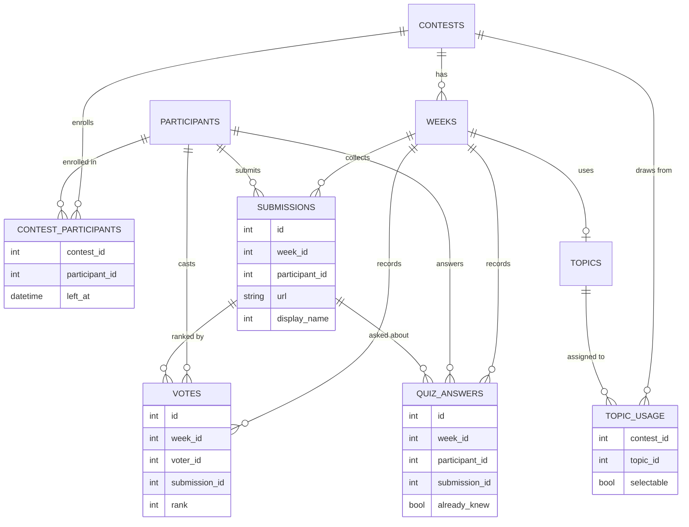

# Architecture

Single Go binary (`cmd/musiccontestbot`); all logic lives under `internal/`
since nothing here is consumed as an importable library (KTD1).

## Data model

`contest_participants` replaces the old `week_participants` roster: enrollment
is per-contest, snapshotted once at `/startcontest`, not re-snapshotted per
week. Strikes are never stored -- `StrikesForParticipant` derives them from
`weeks`/`submissions`/`votes`/`quiz_answers` against each participant's
obligation window. Topic eligibility (`topic_usage.selectable`) is the direct,
renamed successor to the old `used` column -- still a stored per-association
flag, not derived, since it needs to flip and repeat-fallback rather than only
ever grow. `votes` stores only `rank`, not points: a vote's points are a pure
function of its rank and its voter's required-ranking count, so
`submissionPoints` derives them at read time instead of storing the same fact
twice; disqualification (a song known by 3+ beforehand) is applied the same
way, by zeroing a submission's points in `FinalResults` rather than mutating
`votes` when results close.

## Module boundaries

- **`internal/config`** -- environment-variable loading only, no behavior.
- **`internal/storage`** -- SQLite connection (WAL, `SetMaxOpenConns(1)`,
  KTD2) and embedded goose migrations (KTD3). Owns the schema; no business
  logic.
- **`internal/contest`** -- the contest/week state machine (`Engine`),
  deadline math (`Deadline`), and the durable-outbox-backed song
  submission/publication (`SongsHooks`) and voting/questionnaire/results
  (`ResultsHooks`) logic. Depends only on `database/sql` -- never on
  `go-telegram/bot` -- so it stays testable without a Telegram client and
  reusable if the bot's transport ever changed.
- **`internal/bot`** -- all Telegram I/O: command routing, admin
  authorization, chat-member roster sync, and the interactive
  submission/questionnaire/ranking flows. Implements the small notifier
  interfaces (`contest.GroupNotifier`, `contest.ResultsNotifier`) that
  `internal/contest` defines, so the dependency points from `bot` to
  `contest`, never the other way.
- **`cmd/musiccontestbot`** -- composition root: wires config, storage, the
  bot, and the tick loop; owns graceful shutdown (R31).

## Why hooks instead of one combined interface

`SongsCollectionHooks` and `ResultsCollectionHooks` are deliberately
separate interfaces (not one `LifecycleHooks` covering all four methods).
Songs-side and results-side logic are independent slices of work with no
shared state; forcing one object to implement both would couple them for
no reason. `Engine` defaults to no-op implementations of each, so the
state machine is fully testable before either hook is wired in, and
`bot.New` wires the real ones during composition.
